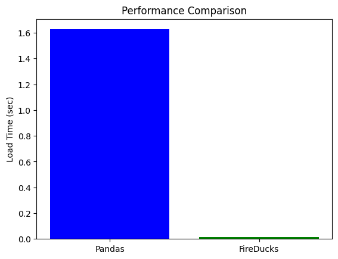

# Fraud Detection with FireDucks

This repository demonstrates how to preprocess large datasets for fraud detection using **FireDucks**, a high-performance library designed for cloud-based pipelines.

## Folder Structure

## Step 1: Setting Up Dependencies
Install all the required libraries listed in the `requirements.txt` file via the command:

```bash
pip install -r requirements.txt
```

### Optional: Using Docker
If you’re on macOS or Windows and can’t install FireDucks directly, use Docker. Create a Dockerfile in the root directory:

```dockerfile
FROM python:3.9-slim

# Install dependencies
COPY requirements.txt /app/requirements.txt
WORKDIR /app
RUN pip install -r requirements.txt

# Copy code and data
COPY . /app

# Run the script
CMD ["python", "code/preprocess.py"]
```

Build and run the Docker container:

```bash
docker build -t fireducks-fraud-detection .
docker run -it fireducks-fraud-detection
```

## Step 2: Generating Dataset
If you don’t have a dataset, you can generate a synthetic one using Python. I have created a script `code/generate_dataset.py` for generating a synthetic dataset. Run the command to generate the dataset:

```bash
python code/generate_dataset.py
```

## Step 3: Preprocessing Data
You can process the dataset whether present locally or in you cloud instances like S3. Code snippet for both are present in the `preprocess.py` file:

```bash
python code/preprocess.py
```

## Step 4: Visualizing Results
Now run the code snippet in the `visualization.py` file to evaluate and to create a GIF comparing performance between both the libraries:

```bash
python code/visualization.py
```

